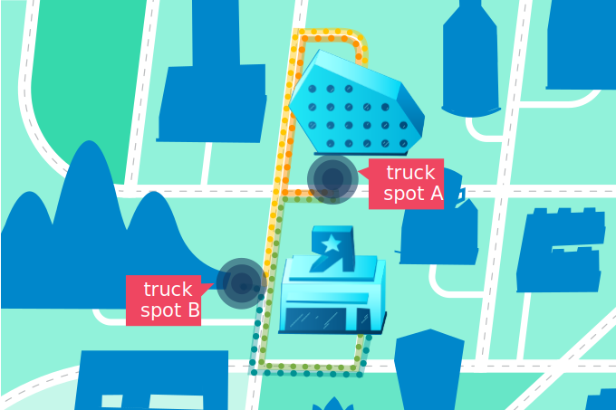
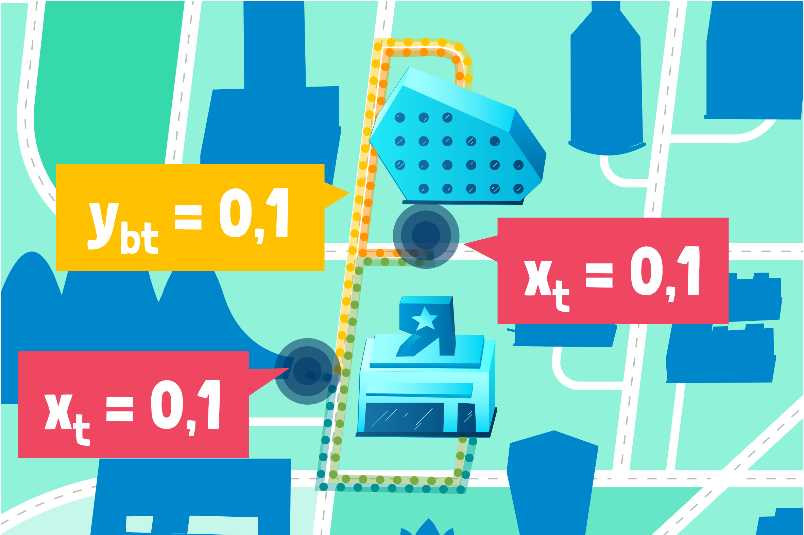
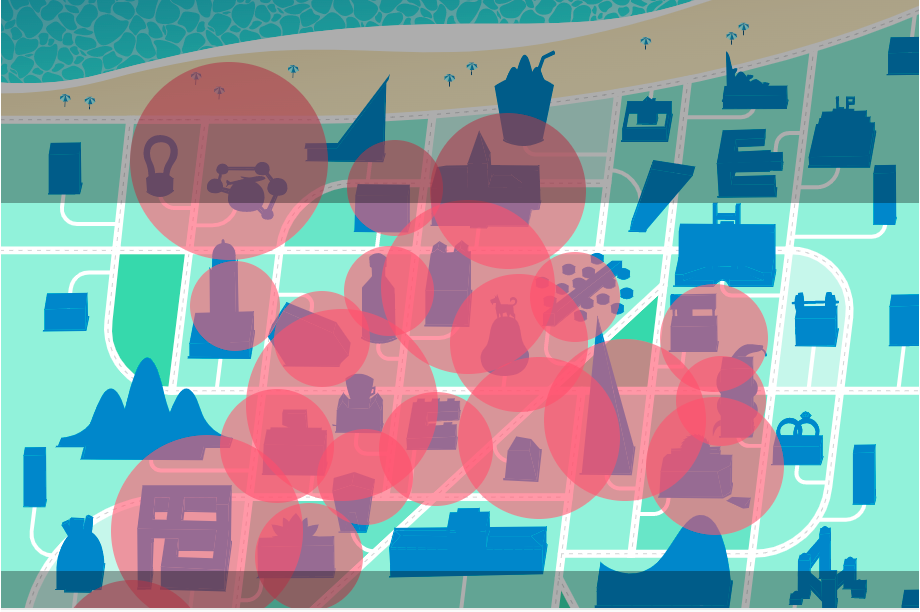

# Burrito Optimization Game Jupyter Notebooks
## Summary
A collection of notebooks to teach gurobipy using the burrito game.  These are broken up into 3 lessons:

| Lesson 1   | Lesson 2:    | Lesson 3:    |
|:-----------:|:-----------:|:-----------:|
| 
<b>Writing your first optimization model</b>
 | 
<b>Write it better</b>
 | 
<b>Write the full model with best practices</b>
 |
| 

       | 

       | 

       |
|  
In the first lesson, you will write your first model of a small version of the Burrito Game. You will start by creating the model object and then adding variables, constraints, and an objective. Finally, you will solve the model and retrieve the solution values.
 | 
In the second lesson, we will rewrite the toy example from Lesson 1 using sets and indices to make the code more compact and efficient. You will be introduced to python and Gurobi data structures like sets, lists, dictionaries, tupledicts, and more.
  | 
In the thirds lesson, we will solve the full Burrito Optimization Game problem.  Lesson 3 combines all that you have learned in 1 and 2 to solve for any day in the Burrito Game Round 1 while applying modeling best practices.
 |
| This is a hands on lesson with a two notebooks (1) `burrito_optimization_game_lesson1.ipynb` which is for students to walk through where they will be asked to 'fill in the blank' to help create varaibles and constraints and (2) `burrito_optimization_game_lesson1_answerkey.ipynb` which provide the answers to `burrito_optimization_game_lesson1.ipynb` | This does not have an blanks to fill in | This also doe snot have any blankstot fill in |

## How to run the notebook

1. Download/clone the notebook(s) of interest
2. Download/clone the util folder. This is used by all of the notebooks in some way.  This is quite a large folder (~40MB).
3. Make sure the notebooks and the util folder are in the same folder.
4. Give it a try.
5. Tell Alison if something goes wrong.

## How to use these notebooks for a course

These notebooks and presentation materials are intended to be an "Introduction to Gurobipy" course.  Ideally, students would have either just taken the "Introduction to Modeling" course or have a little knowledge on how to write models. This is probably a 1.5-2 hour course in it's entirety. This has not been verified.  Though, skipping the Card Game would save ~30 min.

Course outline (using the intro_to_gurobipy.pptx slide deck, Ask Alison for the link)
1. Intro: Go through the bascis of the parts of an optimization in the slide deck. This will be a review for most.
2. Card Game: 
  - Introduce the matching card game using the slides in the ppt presentation.  
  - Ask people to pair up and play the game. 
  - Walk around while people are playing. Be charming and get to know folks.  Part of the goal here is for this to be a bit of an ice breaker.
  - Next review the answers as a group (see slides).
4. Burrito Optimization Game: 
  - Introduce the game using the slides.  
  - Go through the learning objectives of the three lessons.
  - Go through Lesson 1. 
    - Ask the students to open `burrito_optimization_game_lesson1.ipynb`. Then begin walking through the notebook with them.
    - Take a pause after creating the model to make sure everyone's with you and can run the notebook.
    - Take a pause after the 'Data' section to ask the class "Do you think the optimal location is A or B?".  Maybe ask for a show of hands.
    - Take a break after 'Add Variables' and 'add Constraints' sections to let students fill in their part of the notebook.  Walk around the class to ensure people understand what to do.  Let most of the class finish before proceeding.
    - Run setObjective and optimize() as a group and take a peak at the results.
  - After Lesson 1, remind them that Lesson 2 and 3 are available for take home study.  Review what they will learn in each.
5. Go through modeling best practices
6. High five everyone individually.

